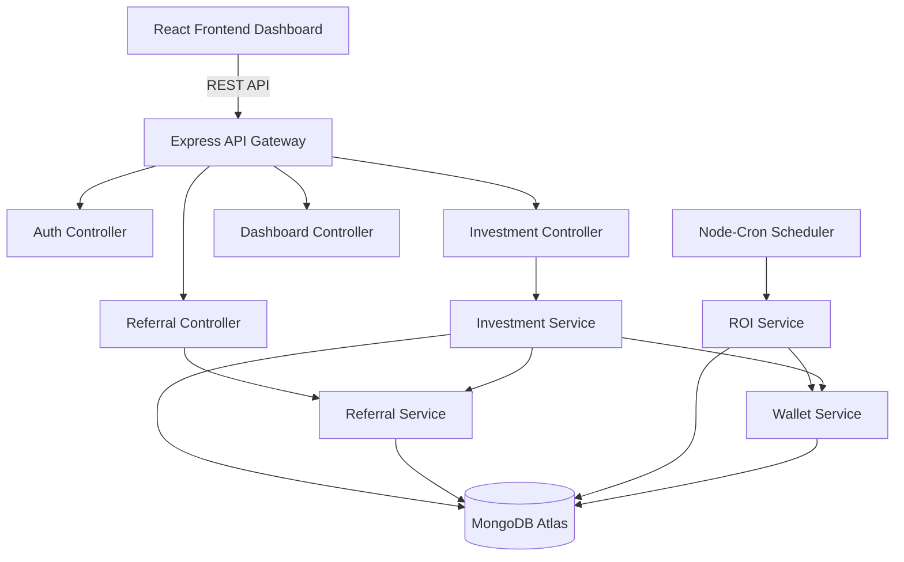
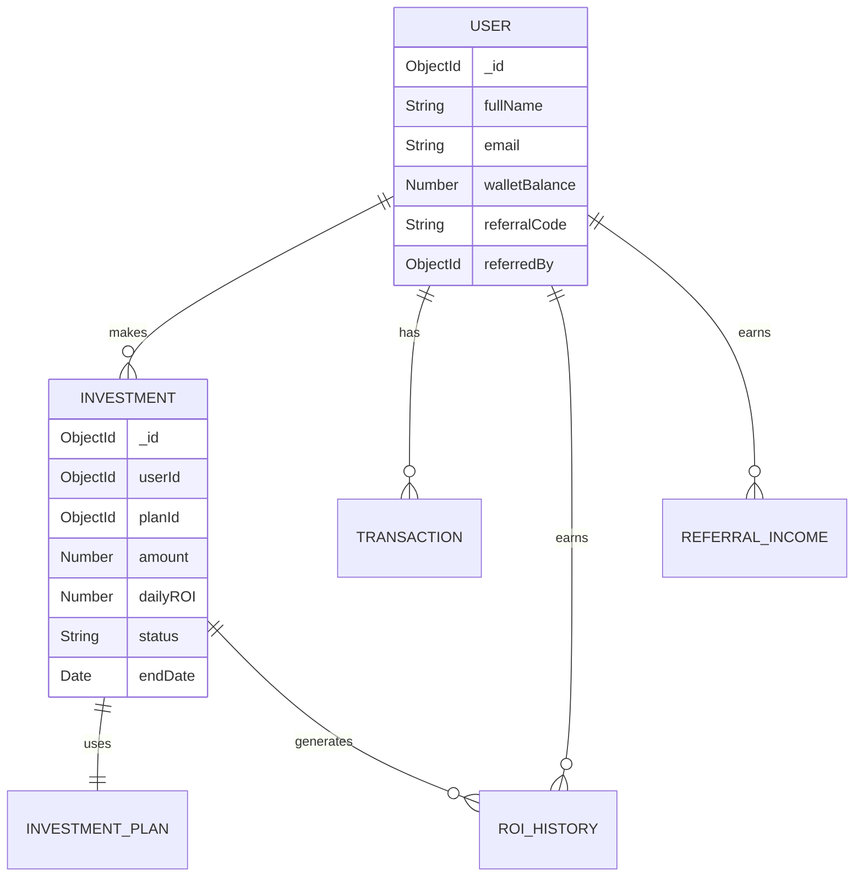

# MERN Investment Platform with Referral MLM Logic

A production-grade investment platform built on the MERN stack (MongoDB, Express, React, Node.js). Features include a multi-level referral system (MLM), automated daily ROI processing with idempotency, robust wallet transaction auditing, and a beautiful React dashboard.

## 🌟 Features
- **JWT Authentication:** Secure login and registration.
- **Referral System:** 3-level MLM referral hierarchy with automated commission distribution.
- **Daily ROI Cron Job:** Automated scheduler that credits daily ROI to active investments (idempotent processing prevents duplicate runs).
- **Wallet & Transactions:** Atomic wallet updates and full transaction history logging.
- **Security:** Helmet, CORS, Rate Limiting, XSS protection, Mongo Sanitize, HPP.
- **React Dashboard:** Vite, Tailwind CSS (v4), Recharts, React Query.
- **Developer Tools:** "Run Daily ROI" admin endpoint to test cron workflows instantly.

## 🏗️ Architecture



## 🗄️ Database ER Diagram



## 🚀 Setup Instructions

### 1. Backend Setup
```bash
cd backend
npm install
```
Create a `.env` file in the `backend` directory:
```env
PORT=5000
NODE_ENV=development
MONGO_URI=mongodb+srv://<your_cluster_uri>
JWT_SECRET=supersecret12345
JWT_EXPIRE=30d
FRONTEND_URL=http://localhost:5173
```
Start the backend:
```bash
npm run dev
```

### 2. Frontend Setup
```bash
cd frontend
npm install
npm run dev
```

## 📜 API Documentation

### Auth
- `POST /api/auth/register` - Create account (supports optional `referralCode` query param)
- `POST /api/auth/login` - Authenticate user

### Investments
- `GET /api/investments/plans` - List available investment plans
- `POST /api/investments` - Create a new investment (requires `planId`, `amount`)
- `GET /api/investments` - List user's investments

### Dashboard
- `GET /api/dashboard/summary` - Get wallet, total ROI, total level income
- `GET /api/dashboard/chart` - Get ROI growth over time
- `GET /api/dashboard/wallet-chart` - Get wallet balance growth over time
- `GET /api/dashboard/recent` - Get top 10 recent transactions
- `GET /api/dashboard/roi-history` - Get raw ROI crediting history
- `POST /api/dashboard/admin/run-roi` - DEV ONLY: Manually trigger the daily ROI cron logic

### Referrals
- `GET /api/referrals/tree` - Get nested referral hierarchy
- `GET /api/referrals/direct` - List 1st-level referrals
- `GET /api/referrals/income` - Get level income history

## ⚖️ Business Logic & Assumptions

### 1. ROI Calculation
Node-cron runs daily at 12:00 AM. It finds all active investments, calculates the ROI, and credits the wallet. 
**Idempotency:** The system checks `ROIHistory` before processing an investment to ensure the same investment is not credited twice on the same calendar day.

### 2. Referral Income
When a user invests, commission is distributed up to 3 levels (10%, 5%, 3%). This is executed within a MongoDB Transaction to ensure that if any step fails (e.g., wallet credit), the entire distribution is rolled back.

### 3. Testing the Cron Job
Because the cron runs at midnight, reviewers can use the `Run Daily ROI (Test)` button on the dashboard. This calls `POST /api/dashboard/admin/run-roi` which securely triggers the service without waiting. Idempotency still applies, so if you want to test it twice, create a new investment first!
